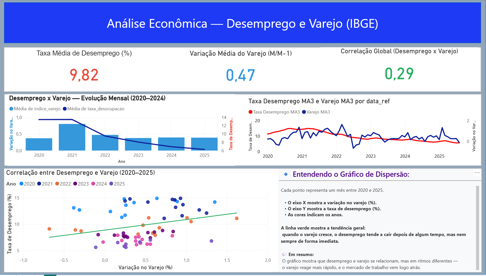
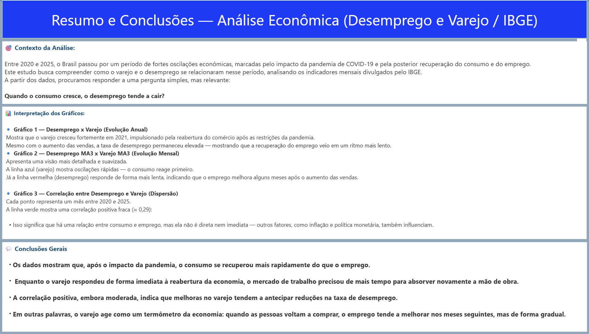

# 🗂️ Documentação Complementar — Dashboard Power BI

### 📊 Visão Geral
Esta seção apresenta o **resultado final da análise e visualização** desenvolvida no Power BI, com base nos dados tratados nas camadas Bronze, Silver e Gold no Databricks.

---

### 🧭 Estrutura do Dashboard

O relatório possui **duas páginas principais**:

#### 🟦 Página 1 — Análise Econômica (Desemprego e Varejo)
- Três indicadores principais:  
  - **Taxa média de desemprego (%);**  
  - **Variação média do varejo (M/M-1);**  
  - **Correlação global (Desemprego x Varejo).**  
- Dois gráficos de linha e um gráfico de dispersão para análise temporal e correlação.  
- Uma caixa explicativa detalhando o **Gráfico de Dispersão** (para interpretação leiga e visual).  

#### 🟩 Página 2 — Resumo e Conclusões
- Contextualização macroeconômica com foco no **impacto da pandemia de COVID-19**.  
- Interpretação gráfica de cada visual do dashboard.  
- Conclusões gerais destacando a **defasagem entre consumo e emprego**.  

---

### 📷 Exemplos Visuais

#### Página 1 — Análise Econômica (Desemprego e Varejo)

#### Página 2 — Resumo e Conclusões

---

### 🧩 Observações Técnicas
- Fonte dos dados: **API do IBGE — Séries Temporais (SIDRA)**.  
- Período analisado: **2020 a 2025**.  
- Linguagem de tratamento: **Python (PySpark)**.  
- Visualização final: **Power BI Desktop**.
